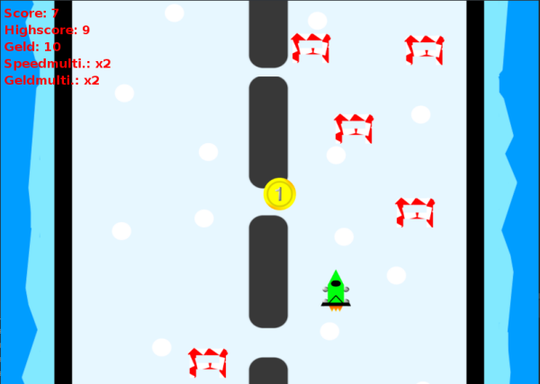
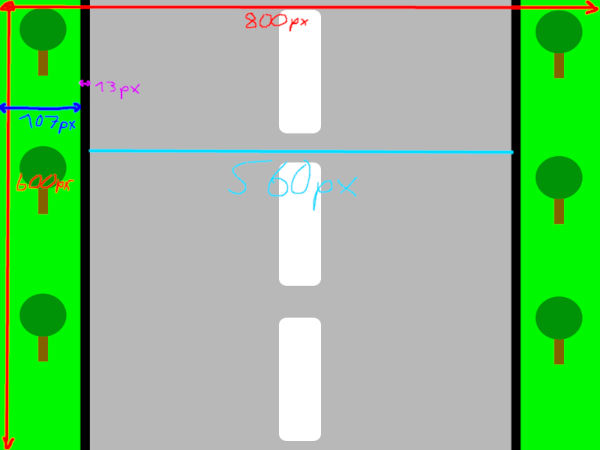

# Auto Spiel Remastered

Drive through different biomes and dodge obstacles while collecting coins.



## Features

- 8 different biomes
- biomes with less friction
- upgrade your car to move quicker or earn more money
- custom biomes ([tutorial](#custom-biomes))

## Custom biomes

You can create custom biomes with your own sprites and friction settings. Here's how:

### Creating the biome definition file

First locate the resource directory of Auto Spiel Remastered. If you have just downloaded the game it should be in `autospiel-remastered/rsc`.
Now place a file named `<your-biome-name-here>.json` and place it into the `biomes` directory, e.g. `autospiel-remastered/rsc/biomes/custom.json`.
Inside this file you can specify the different parameters of you biome. The following is the default configuration of the `grass` biome:
```javascript
{
  "name": "Wiese", // The name of your biome
  "friction": 100.0, // The friction of the road (100: no sliding, 0: won't slow down)
  "background": "rsc/sprites/backgrounds/grass.png", // location of the background image relative to the root directory
  "obstacle": "rsc/sprites/obstacles/barrier.png", // location of the obstacle image relative to the root directory
  "coin": "rsc/sprites/coins/coin.png" // location of the coin image relative to the root directory
}
```

### Creating custom sprites

#### Background

Place a png file named `<your-biome-name-here>.png` into `sprites/backgrounds` with the following dimensions and reference it in the `background` field inside of the [biome definition file](#creating-the-biome-definition-file).



### Obstacle

Place an 80x60 png file named `<your-biome-name-here>.png` into `sprites/obstacles` and reference it in the `obstacle` field of the [biome definition file](#creating-the-biome-definition-file).

### Coin

Place a 50x50 png file named `<your-biome-name-here>.png` into `sprites/coins` and reference it in the `coin` field of the [biome definition file](#creating-the-biome-definition-file).

## Building

Clone the repo and open it in [IntelliJ IDEA](https://www.jetbrains.com/idea/).
```sh
git clone https://github.com/Bananenpro/auto-spiel-remastered.git
```

1. Hit `Add configuration` -> `+` -> `Application` -> `Main class` -> `Game` -> `OK`.
2. Hit `File` -> `Project Structure` -> `Libraries` -> `+` -> `Java` -> `auto-spiel-remastered/lib/json-simple/json-simple-1.1.jar` -> `OK`
3. Hit the green arrow to run the project

## License

This program is free software: you can redistribute it and/or modify
it under the terms of the GNU General Public License as published by
the Free Software Foundation, either version 3 of the License, or
(at your option) any later version.

This program is distributed in the hope that it will be useful,
but WITHOUT ANY WARRANTY; without even the implied warranty of
MERCHANTABILITY or FITNESS FOR A PARTICULAR PURPOSE.  See the
GNU General Public License for more details.

You should have received a copy of the GNU General Public License
along with this program.  If not, see <http://www.gnu.org/licenses/>.

## Copyright

Copyright © 2021-2022 Julian Hofmann
